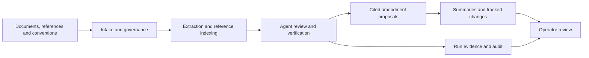

# Project Shimmer

Shimmer is a governed document-review prototype. It reviews documents against
operator-supplied conventions and reference material, proposes cited amendments,
and records the reasoning workflow in inspectable artifacts. Source documents
remain intact; amendments are proposals for a person to review.

The system combines model reasoning, typed findings, deterministic comparisons
and cross-model verification. Its 18 registered agents have distinct roles and
conditional activation, so a run need not call every agent. An append-only
constitution governs changes and operator decisions.

## How review works

1. Supply the documents to review, supporting references and review conventions.
   Identify prior versions separately when comparison is needed.
2. Choose the backend and privacy posture, review the intake summary and confirm.
3. Follow findings, citations, agent activity and any governed questions in the
   console. Inspect refusals and coverage as well as proposed changes.
4. Review the summaries, amendment master and tracked-changes document. Keep the
   run's evidence alongside its deliverables.



This is the data flow. Scheduling follows the actual dependencies and governance
gates; the diagram does not imply concurrent model calls. The
[runtime reference](docs/RUNTIME_REFERENCE.md) explains each agent and downstream
consumer.

## Getting started

On a prepared Windows checkout, launch:

```powershell
.\start_shimmer.bat
```

The desktop starter selects a Python environment, checks prerequisites, starts
the loopback server and opens the console. Use its **Copy token** control to
connect the browser session. Keep the starter open and use **Stop** to stop its
server; closing the browser leaves the server running.

A fresh checkout needs Python 3.12.x and dependencies compatible with the
chosen backend. The authoritative constraint is in
[tools/cloud_run/runtime.json](tools/cloud_run/runtime.json): Python 3.12.x for
compatibility, exactly 3.12.3 for the sealed cloud reference profile. Launchers
query candidates and retain an absolute compatible executable. Experiment source
compilation/import checks precede dependency installation and model acquisition;
the image-default `python` is not assumed compatible. Local Review also needs the configured Qwen, Phi and bge-m3 model
assets and a compatible CUDA runtime. Local generation decodes under the frozen
evaluation policy declared in [config/decoding_policy.json](config/decoding_policy.json)
and read from the tuning protocols it names (greedy, single beam), so a checkpoint's own
sampling defaults never govern a review. Readiness reports missing prerequisites;
it does not install models or generate a sample review. See
[requirements.txt](requirements.txt), the
[runtime prerequisites](docs/RUNTIME_REFERENCE.md#persistence-prerequisites-and-image-boundary)
and the [operator runbook](docs/RUNBOOK.md) before preparing an environment.
Keep provider credentials outside the repository and configure them through the
supported private configuration path.

| Choice | Behavior |
|---|---|
| Review | Reviews selected targets against conventions and supporting material, with optional prior-version comparison. |
| Draft | Generates an initial memo through Claude, then reviews it. Local Draft is unsupported. |
| Local backend | Uses the local producer/auditor model profiles for Review and defaults to paired review. Cached packages and models are required. |
| Cloud backend | Uses configured provider models and defaults to wide review. Provider credentials and charges apply. |
| Normal privacy | The operator declares the input non-sensitive; full content is reviewed with the recorded inactive-layer/no-redaction overrides. |
| Sensitive privacy | Requires an active sensitivity layer. The shipped layer is inactive, so ordinary Sensitive submission is refused. |

The backend is selected when the server starts. Local Review needs no provider
API call, but selecting Local does not enforce a network air gap. Health reports
server liveness and declared posture, not generation readiness or review quality.

## Results and evidence

Each run has its own folder under `output/runs/`. Per-document deliverables include
grounding and document summaries, `review_data.json`, `review_findings.md`,
`tracked_changes.docx` and `reviewed_document.md`. The JSON amendment master is the
source for the Markdown and DOCX renders. A run summary indexes the deliverables.

The console exposes findings, source excerpts, amendment refusals, contract
violations, agent activity and completion evidence. Logs and audit artifacts
preserve additional detail. A finished process or downloadable ZIP does not
establish complete coverage: inspect missing evidence, capped replies, failed
contracts and unjudged rules before accepting a result.

Operator inputs, durable learning, governance records and ontology stores are
separate from disposable run output. Preserve them when updating or backing up
an installation. The [runbook](docs/RUNBOOK.md#preserve-and-back-up-state) describes
backup coverage and interruption handling.

## Optional capabilities

Run-level input and output language controls support English and Turkish public
output instructions while preserving machine identifiers and source quotations.
Agent Execution Briefs describe the interfaces of all 18 agents. See the
[language and strategy contract](docs/api/RUN_LANGUAGE_AND_STRATEGY.md).

Explicit multi-round positioning analyzes declared rounds, actors, issues and
evidence histories. Recommendations require a separate opt-in. This case mode
has its own artifacts and does not produce ordinary review amendments. Its
contracts have deterministic fixture validation; real-model quality, runtime and
scaling remain unverified. See the
[multi-round guide](docs/fix/MULTI_ROUND_IMPLEMENTATION.md).

`reference_serial` is the default execution topology. `dependency_dag` supports
bounded scheduling and explicit resident workers for ordinary Review. The
earlier DAG adapter retains rolling-bus semantic ordering. The explicit local
`report_optimized` topology adds bounded source-span extraction, sibling semantic
waves, exact-comparison reason rendering and completion-aware telemetry. Its
PROCESSOR call is sent in the exact two-turn shape the tuned checkpoint was
evaluated on (`config/compact_extraction_prompt.json`), at most two owned spans
per request as in every validated input, with every indexed
passage marked by its own reference id, and a cited reference is grounded by
Python's placement of that passage in the span. Accepted items of a partition
whose sibling failed still reach the auditors and the advisory classifier,
marked partial. A document's title block is its own unit (`u00`), so a rule
about a document-level figure can reach it; existing unit ids never move. It is
experimental, with real-model quality and performance still unverified. See the
[Report Recommendations implementation](docs/fix/REPORT_RECOMMENDATIONS_IMPLEMENTATION.md). Dense activation is
the default; sparse activation retains the conservative policy. Neither option
establishes a general speedup. The
[topology report](docs/fix/EXECUTION_TOPOLOGY_OPTIMIZATION.md) explains the boundary.

## Deployment

The [Dockerfile](Dockerfile) supports an external model cache or baked weights
with `BAKE_WEIGHTS=true`. Source layers follow dependency and weight layers so
source changes can reuse the build cache. [compose.yaml](compose.yaml) uses a
named image; it does not build one. Operator input, durable state, run evidence
and credentials must be supplied separately. Container entry points are `serve`,
`run` and `verify`; the full verification command can load models.

For a controlled single-GPU experiment, the
[cloud preparation guide](docs/CLOUD_RUN_PREPARATION.md) covers source and model
pinning, local validation, an explicit existing SSH identity, deployment dry-run,
manual provisioning and budgeted teardown. This is a separate experiment workflow
from the provider-backed Cloud option in the console.

## Development and validation

Read [CLAUDE.md](CLAUDE.md) for contribution rules and [genesis.md](genesis.md) for
the founding design. The design includes broader aspirations; current runtime
behavior is documented in the [runtime reference](docs/RUNTIME_REFERENCE.md),
including checked agent/model, API-route and environment-variable tables.

The following checks block model/provider imports and network use, or use mocked
deployment transports. They do not launch a GPU workload:

```powershell
python -B -X utf8 scripts/report_recommendations_no_generation_gate.py
python -B -X utf8 scripts/brief_language_strategy_no_generation_gate.py
python -B -X utf8 tools/cloud_run_checks.py --json
python -B -X utf8 tools/cloud_run_transport_checks.py
python -B -X utf8 tools/cloud_run_transfer_checks.py
```

The full `scripts/verify_session1.py` gate includes model-loading checks even in
offline mode. Run it only in an appropriately prepared and authorized environment.
Fixture success verifies contracts and behavior under those fixtures, not general
semantic quality, privacy assurance or end-to-end deployment readiness.

## Evidence and limitations

Shimmer remains a prototype with corpus-dependent coverage. Deterministic checks
depend on usable fields and scope; model output can be incomplete, incorrectly
grounded or internally inconsistent. Ontology views expose persistent structural
records but do not feed learned relevance back into ordinary agent tasks. Local
Draft, usable Sensitive review and automatic mid-run resume are not supported.

Saved synthetic runs establish narrow observations, not general quality or
latency guarantees. Measurements and their qualifications live in the
[local performance diagnostic](docs/fix/LOCAL_PERFORMANCE_DIAGNOSTIC.md),
[activation audit](docs/fix/AGENT_ACTIVATION_AUDIT.md),
[A100 smoke report](docs/fix/A100_CURRENT_VERSION_SMOKE.md) and
[optimized A100 run report](docs/fix/A100_OPTIMIZED_RUN.md).
The [routing audit](docs/fix/ROUTING_UI_AUDIT.md) traces implementation and historical
verification. Human review of the source evidence remains necessary.
