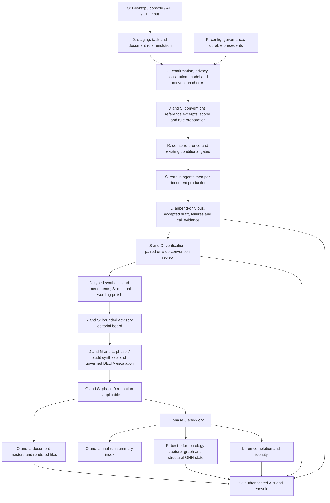

# Project Shimmer

Multi-round positioning is implemented as an explicit optional case mode, with
deterministic fixture validation only. It has not been executed with real models,
benchmarked, or exercised by a cloud workload. Runtime, cost, scaling and substantive
quality remain **UNMEASURED / UNVERIFIED**. See the
[implementation report](docs/fix/MULTI_ROUND_IMPLEMENTATION.md).
Ordinary Review/Draft and dense/sparse defaults retain pre-multi-round behavior.
The comparison baseline remains `47c63aca09603ab5c7ad662753d647397a623ce8`.
The next locked item is **Current-version cloud composite experiment**, not begun.

Shimmer is a governed document-review prototype. It combines model reasoning with
typed findings, deterministic comparisons, citations, proposed amendments and an
auditable record of what ran. It has 18 registered agents; conditional phases
mean a run need not call all 18. A completed process is not proof of complete
coverage, correct reasoning or successful privacy treatment.

Start with the [operator runbook](docs/RUNBOOK.md). The
[routing/UI audit](docs/fix/ROUTING_UI_AUDIT.md) traces producers and consumers,
records contradictions and states the verification boundary. The
[previous README](docs/history/README_PRE_ROUTING_AUDIT.md) preserves historical
design detail and measurements verbatim; its old current-state claims are superseded.
[genesis.md](genesis.md) records the founding design and [CLAUDE.md](CLAUDE.md) the
project's working rules. Their broader design descriptions are not evidence that
every proposed runtime path is implemented. Constitution and governance files
remain authoritative for governed decisions.

## Start and choose

On the configured Windows installation, run `start_shimmer.bat`. The desktop
starter selects the available Python environment, reports readiness, owns a
loopback server, opens the console and supplies a copyable session token.
Readiness checks declared packages, cache artifacts and posture; it does not
generate a test document or certify model quality. A failure needs its reported
prerequisite corrected before starting. `/health` is liveness and declared server
posture, not the readiness test. Closing the browser does not stop the server;
use the desktop starter's Stop control.

| Choice | Actual behavior and boundary |
|---|---|
| Review | Upload documents, identify review targets and optional prior versions; other documents can ground the review. The native console requires privacy selection and confirmation. |
| Draft | A question creates a free-text memo through a direct Claude call, then reviews it. **Local Draft is unsupported**: the initial memo path is not routed to Local generation. |
| Local | Review remaps agent models to the local producer/auditor profiles below, defaults to paired review and serializes local generation. No provider API call is needed for Local Review. Cached models/packages are required. Local is not an enforced network air gap; use explicit offline controls when testing that boundary. |
| Cloud | Uses registry provider models, defaults to wide review, needs configured provider credentials and can incur provider charges. Availability is governed and checked; the registry's model names are configuration, not a promise of current provider availability. |
| Normal | Declares non-sensitive input and records the inactive-layer/no-redaction overrides. Full content is reviewed. This is an operator declaration, not a content detector. |
| Sensitive | Requires the sensitivity layer to be available and active. The shipped layer is inactive, so ordinary Sensitive submission is refused. No usable Sensitive review or privacy certificate is claimed for this build. |

The server backend is selected at startup, not per upload. The console's health
badge shows that server's current posture; old run records do not persist a
backend field. Task, privacy and review mode are separate choices. Native intake
does not accept existing conflicting files or bypass governed convention changes.

## Current evidence and limitations

These are saved synthetic measurements, not new measurements of this documentation
and UI revision. [Performance diagnostic](docs/fix/LOCAL_PERFORMANCE_DIAGNOSTIC.md),
[quality baseline](docs/fix/LOCAL_PERFORMANCE_DIAGNOSTIC.md#dense-quality-baseline-addendum-2026-09-13) and
[speed audit](docs/fix/LOCAL_SPEED_OPTIMIZATION.md) retain the evidence and caveats.

| Evidence | Accepted interpretation |
|---|---|
| Dense Local baseline, `clinical_reference`, run `758b17f33e6344f4902024e53d4b38e1` | **84m 14.4s**, 26 model calls; 97.9% of wall time in generation. One saved run, not a general latency estimate. |
| Dense quality baseline | **3/5 location recall**, 0 amendment false positives, 0 clean-item flags, 3/3 attribution. Reason scoring unavailable; all five review-state classifications unknown. BIRCH's typed lower bound is 3.5 but its prose says 5.0. FIRTH and the sheet-level flaw were missed. |
| Dense speed audit | **No accepted runtime optimization.** Component probes did not justify a safe material speedup. |
| [Activation audit](docs/fix/AGENT_ACTIVATION_AUDIT.md), run `35f04de9d00042a6ba9f30e7c683ff33` | 20 calls versus 26, 96m 45.94s versus 84m 14.4s. Six fewer calls came from existing legal deepening behavior after an empty/capped initial reply; **zero newly suppressed routing calls**. Wall time increased 14.87%; the comparison was thermally confounded. |
| Activation quality comparison | Same location/false-positive/attribution counts and amendment arrays; **broad quality preservation was not established**. PROCESSOR grounding regressed to the wrong source. Recovered or capped replies do not establish correctness. |

`--activation-profile dense` is the default and retains reference firing.
`sparse` currently retains the same conservative policy and existing phase gates.
No new suppression rule was accepted; no sparse speedup or general promotion is
claimed. Semantic expertise is not replaced with deterministic relevance guesses.

Coverage remains corpus-dependent. Exact field labels, scope declarations and
numeric parsing constrain deterministic comparisons. Missing fields without a
usable scope can remain unasked; changing both a prior-version label and its value
can look like withdrawal. Arithmetic agreement does not prove the interpretation
of a negotiation. A clean amendment list can coexist with contract failures,
refused questions, unjudged rules or wrong source grounding. The old clinical,
catalogue, device, negotiation and cloud-era scores remain historical in the
archived README; they are not current capability or reliability estimates.

## End-to-end architecture

Legend: **D** deterministic infrastructure, **S** semantic/model reasoning,
**G** governance gate, **R** activation/routing, **L** run-local record,
**P** persistent state, **O** operator-facing surface. Arrows show dependency
order, not parallel execution. Local generation is serialized. Cloud can use
bounded per-document concurrency; corpus preparation still precedes document work.



The numbered runtime order is BOOT/preparation, production (corpus then documents),
verification (5), convention review (5.5), synthesis (6), editorial review (6.5),
audit synthesis and governed DELTA escalation (7), redaction (9), then end-work (8).
The diagram groups audit/end records for readability: audit synthesis is written
**before** redaction; the final deliverables index follows end-work. Draft adds
phase 0 before ordinary review. Ontology capture and GNN maintenance are best
effort at the end; their failure does not itself fail a completed review. There
is no ontology/GNN-to-review-agent feedback arrow in the current runtime.

### Input, role and governance routing

`server.submit` normalizes multipart fields, enforces upload caps and stages files.
Explicit `intake_mode=standalone` uses `server._standalone_plan` and `intake_wizard.classify`, requires `confirmed=true`
and literal `sensitive=true` or `false`, and validates target/prior filename arrays.
The worker revalidates placement and creates files exclusively; native cleanup
removes only unchanged files it created. Omitting intake mode retains the legacy
ingestion validator and `_corpus_ingest.json` contract even if the pipeline mode
is standalone. Legacy defaults and cleanup are different; native preservation
guarantees must not be attributed to every API path.

`role_resolution` uses the explicit review-target manifest, then mandate targets,
then sidecar/date-cutoff information. Inference is a guarded stub, not a semantic
role classifier. Prior files are grounding, not new targets; ambiguous overlaps
do not manufacture a comparison. Unknown dates fail a dated cutoff unless an
explicit role overrides it. Review objectives from the question/CLI enter phase
payloads; editorial review constructs its own objectives. There is no guarantee
that every agent receives an identical question prompt.

Convention loading preserves required/recommended/advisory severity and structural
scope/requires/unless declarations. Subject assignment uses exact declared tags;
unassigned or consumer-less rules are recorded. Paired review computes supported
arithmetic and declared absence, and sends semantic judgments to the eligible
reviewer. Unresolved applicability is refused rather than inferred as irrelevant.
Some older relevance/label mechanisms remain heuristic. External rule proposals
and answered structural conflicts are loaded, but applicable external rules are
not automatically merged into the compiled convention registry.

### All 18 agents: actual tasks, profiles and downstream consumers

Model values below are the shipped registry's Cloud configuration and pipeline's
Local overrides resolved through `config/local_models.json`. That file selects the
prequantized producer/auditor checkpoints; missing selections retain the original
full-precision fallbacks. REDACTOR keeps its separate registry Qwen checkpoint.
The generated harness describes this configuration, not the
model used by a historical run; use that run's bus and cost/call records for that.

| Agent | Runtime role | Gate/trigger | Cloud backend / model | Local backend / model | Input -> output -> consumer |
|---|---|---|---|---|---|
| `PROCESSOR` | Extract/draft per document | P | `claude_api` / `claude-sonnet-4-6` | `local_producer` / `unsloth/Qwen2.5-7B-Instruct-bnb-4bit` | source document -> typed draft -> VERIFIER/FACT_CHECKER; per-agent report |
| `VERIFIER` | Check draft fidelity | V | `openai_api` / `gpt-4o` | `local_auditor` / `unsloth/Phi-3.5-mini-instruct-bnb-4bit` | accepted draft + source -> findings -> synthesis/report/bus |
| `FACT_CHECKER` | Check draft claims | V | `openai_api` / `gpt-4o` | `local_auditor` / `unsloth/Phi-3.5-mini-instruct-bnb-4bit` | accepted draft + source; permitted search -> verdicts/references -> synthesis/report/bus |
| `PRACTICE_AUDITOR` | Convention conformance | J | `openai_api` / `gpt-4o` | `local_auditor` / `unsloth/Phi-3.5-mini-instruct-bnb-4bit` | assigned rules + units -> typed findings -> amendments; wide also sees inventory |
| `LEGAL_ANALYST` | Legal basis/precedent and bounded deepening | P+L | `claude_api` / `claude-opus-4-8` | `local_producer` / `unsloth/Qwen2.5-7B-Instruct-bnb-4bit` | source + ARCHIVIST inventory -> findings -> amendments/report/bus |
| `STYLE_GUARDIAN` | Wording conventions | J | `claude_api` / `claude-haiku-4-5` | `local_producer` / `unsloth/Qwen2.5-7B-Instruct-bnb-4bit` | assigned wording rules + units -> typed findings -> amendments |
| `ARCHIVIST` | Corpus structure and chronology | C | `claude_api` / `claude-sonnet-4-6` | `local_producer` / `unsloth/Qwen2.5-7B-Instruct-bnb-4bit` | corpus digest -> inventory -> legal and wide practice tasks; bus |
| `INST_FINDER` | Institution mapping | C | `claude_api` / `claude-haiku-4-5` | `local_producer` / `unsloth/Qwen2.5-7B-Instruct-bnb-4bit` | corpus digest -> registry items -> audit and bus context; no named final-document reader |
| `CITATION_RESOLVER` | Cross-document citation chains | C | `claude_api` / `claude-haiku-4-5` | `local_producer` / `unsloth/Qwen2.5-7B-Instruct-bnb-4bit` | corpus digest -> graph items -> audit and bus context; not the deterministic REF index writer |
| `SPEECH_ACT_TAGGER` | Tag speech acts per document | P | `claude_api` / `claude-haiku-4-5` | `local_producer` / `unsloth/Qwen2.5-7B-Instruct-bnb-4bit` | source -> tags -> report and shared bus context |
| `REDACTOR` | Apply operator redaction rules | R | `qwen_local` / `Qwen/Qwen2.5-7B-Instruct` | `qwen_local` / `Qwen/Qwen2.5-7B-Instruct` | compiled rules + master -> scrubbed renders or NONE/BLOCKED/HELD_WARNING/SKIPPED |
| `AMENDMENT_DRAFTER` | Optional wording polish; separate Draft memo | M | `claude_api` / `claude-opus-4-8` | `local_producer` / `unsloth/Qwen2.5-7B-Instruct-bnb-4bit` | typed irregular findings -> allowed wording fields; Draft question/retrieval -> memo then review |
| `EDITOR_CLERK` | First advisory editorial review | E0 | `claude_api` / `claude-opus-4-8` | `local_producer` / `unsloth/Qwen2.5-7B-Instruct-bnb-4bit` | master -> observations -> next rank or final advisory record |
| `EDITOR_HEAD_OF_UNIT` | Provision/neighbors review | E1 | `claude_api` / `claude-opus-4-8` | `local_producer` / `unsloth/Qwen2.5-7B-Instruct-bnb-4bit` | lower-rank observation + evidence -> advisory confirmation/override/escalation |
| `EDITOR_HEAD_OF_SECTION` | Provision/neighbors review | E2 | `claude_api` / `claude-opus-4-8` | `local_producer` / `unsloth/Qwen2.5-7B-Instruct-bnb-4bit` | lower-rank observation + evidence -> advisory confirmation/override/escalation |
| `EDITOR_HEAD_OF_DEPARTMENT` | Whole-deliverable coherence | E3 | `openai_api` / `gpt-4o` | `local_auditor` / `unsloth/Phi-3.5-mini-instruct-bnb-4bit` | lower-rank observation + master -> advisory confirmation/override/escalation |
| `EDITOR_DEPUTY_DG` | Necessity/proportionality | E4 | `openai_api` / `gpt-4o` | `local_auditor` / `unsloth/Phi-3.5-mini-instruct-bnb-4bit` | lower-rank observation + master -> advisory confirmation/override/escalation |
| `EDITOR_DG` | Terminal necessity judgment | E5 | `openai_api` / `gpt-4o` | `local_auditor` / `unsloth/Phi-3.5-mini-instruct-bnb-4bit` | lower-rank observation + master -> terminal advisory verdict |

Gate/trigger keys define eligibility, activation, repeat bounds and UI exposure:

| Key | Eligibility, activation reason and repeat bound | Operator-facing effect |
|---|---|---|
| C | Once per reached corpus phase with work. `reference_scheduled` in dense, `conservative_retained` in sparse. | Bus/audit and downstream context. No direct final-document reader for INST_FINDER/CITATION_RESOLVER does not mean no effect. |
| P | Once per operational document in production; same reference reasons. | Accepted draft/findings and per-agent report; shared context. |
| L | Local LEGAL pass-one findings trigger `local_finding_deepening`, up to `DEEPEN_MAX_FINDINGS=6`, serially. Empty/unavailable first pass or cap is recorded; retained initial findings are not silently discarded. | Deepened legal findings; no automatic retry for a malformed contract. |
| V | Once per operational document in phase 5; accepted PROCESSOR projection plus source and draft-availability metadata. | Findings, report, references and synthesis. Missing draft is not invented content. |
| J | Wide: assigned or untagged rules. Paired: first eligible consumer for the rule; untagged defaults to PRACTICE_AUDITOR. Per-plan semantic questions; computed cases can need no call. Missing consumer/refused applicability/no work remains explicit. | Pairing map, typed findings, refusals and amendments. |
| M | Fresh bus payload bypasses polish; otherwise `--amendment-polish` permits one call per typed irregular finding. Default is deterministic templates. Only explanation/proposed text may be polished. Draft separately makes one free-text memo call. | Master and rendered amendments; memo for Draft. |
| E0-E5 | Readable master and permissible privacy posture. Clerk starts; each next rank requires lower confidence than the configured threshold (default 0.7) or enabled out-of-mandate trigger. Configured board cap bounds climbs; failure does not summon a contract retry. | Advisory records and annotations only; board does not rewrite the master or decide whether it ships. |
| R | Active sensitivity layer, no waiver, compiled rules and readable master. Phase entry alone is not a call. | Redaction state and regenerated deliverables. HELD_WARNING differs from NONE; BLOCKED produces nonzero exit. |

The common structured path is `AgentWrapper.run_task`: constitution check,
`bus_reader.assemble_context`, backend dispatch, parsing/recovery, contract
validation and bus post. Recent bus text, canonical latest items and traffic
counts enter bounded context. Corpus outputs therefore can affect later prompts
without a named report reader. A contract violation is a distinct bus/audit record
and its items are withheld. Provider transport backoff is separate from contract
retry. Draft's initial free-text call bypasses this envelope path.

`audit/agent_activation.json` records eligibility, requested activation, actual
dispatch attempt, reason, phase, trigger, repeat bound and outcome. A dispatch is
not necessarily successful generation. `phase_not_reached` has unknown eligibility;
`ineligible`, `eligible_inactive`, `activated_not_dispatched`, preparation failure,
execution failure, completion, recovery and truncation must not be collapsed.

## Outputs and operator surfaces

### Optional multi-round positioning

Explicit `--multi-round --multi-round-manifest <case.json>` selects case analysis
for Review. Both existing non-sensitive declarations are required. API callers
add `multi_round=true` and `multi_round_manifest` JSON to an explicit Normal Review
submission; the console exposes the same opt-in under Advanced options. Multiple
uploaded files alone never activate it. A fixture-marked manifest cannot start a
live case phase. Dense/sparse remains an independent routing choice.

The operator declares rounds/order, actors, issues, and source spans in the case
manifest. PROCESSOR drafts flat typed observations and interpretations; VERIFIER
independently checks them through the existing governed wrapper. Deterministic
code validates identity/evidence links, assembles histories and computes same-unit
numeric deltas. It does not decide concessions, hardening, reversals or agreement.
Accepted uncertainty, competing interpretations, refusals and missing evidence
remain visible. Advice requires `allow_recommendations=true` separately.

The run-local master is `audit/multi_round.json`, with source handles in the
existing `audit/reference_index.json`, reviewed envelopes on the run bus, and
ordinary call/activation/completion provenance. The authenticated case route and
console expose histories, movement, unresolved issues, trajectory, decision
support and clickable evidence. Current positions come only from the latest
declared round; missing actors are never silently carried forward. The explicit
case branch returns before ordinary date-cache, adaptive-learning, amendment and
ontology/GNN processing. It does not produce conventional review amendments or
promote negotiation state into durable memory. Existing startup model/privacy
governance still applies; Sensitive case analysis is unavailable.

Ordinary runs require no case artifact, read no case manifest, use no case contract
and gain no model call. The first cloud experiment can still measure the pinned
pre-multi-round behavior. Fixture success establishes contracts, not model quality.

### Existing review artifacts

The [artifact routing table](docs/fix/ROUTING_UI_AUDIT.md#artifact-routing) names
each writer and reader. `RunContext` defines the run folder and canonical files:

```text
output/runs/<run folder>/
  deliverables/_run_summary.md
  deliverables/<doc_id>/
    grounding_summary.md       document_summary.md
    review_data.json           review_findings.md
    tracked_changes.docx       reviewed_document.md
    memo.md                    (Draft only)
  logs/agent_bus.jsonl         cost_tracker.jsonl / cost_tracker.json
  logs/call_evidence.jsonl     pipeline_stdout.log (server runs)
  audit/reference_index.json  pairing_map.json / convention_assignment.json
  audit/agent_activation.json run_completion.json / run_identity.json
```

`review_data.json` is the amendment master; Markdown and DOCX are renders, not
independent findings. Audit synthesis, editorial records, DELTA proposals,
contract-violation dumps and approval artifacts also live under `audit/`.
Scorers join saved bus, pairing/assignment, call evidence, master and completion;
they do not infer clean coverage from empty output.

In the console, Agent activity shows the **recorded** profile, dispatch/non-call
counts, unreached agents, failures and capped/recovered replies. Developer view
adds per-agent states, reasons and bounded re-fire details. Missing, malformed or
wrong-run evidence is unavailable, not zero activity. Completion evidence is
shown separately from process status; neither is a quality score. Assignment's
`idle_agents` uses current subject declarations and is not actual call history.

REF citation clicks read this run's `reference_index.json`. Unknown IDs return
404; a missing index is explicitly absent. WEB-REF labels are currently text only
in the console. Rule clicks read the **current** compiled registry and now say
they may differ from the rule used by the run. Historical rule snapshots are not
served. Findings/pair projections omit some on-disk absence, band-condition and
prior-comparison detail; inspect the original artifacts when diagnosing coverage.

Downloads archive existing files, including partial output. A document marked
done means its folder contains a file, not that all stages completed. The whole-run
ZIP's `X-Shimmer-Partial` reflects server outcome; it is not a privacy or quality
certificate. Per-document downloads have no equivalent full-run partial header.
Archive endpoints do not enforce a separate privacy-release gate. Do not equate
downloadability with validated Sensitive output.

## API and developer entry points

`scripts/server.py` runs a single job worker. `GET /console` and `GET /health` are
public; data and action routes below require Bearer authentication against the
configured token hash. The desktop starter handles token creation without storing
the plain token. The browser keeps it in session storage and sends the header;
do not put credentials in URLs, logs, source or examples. No server shutdown
endpoint exists. Cancel a run through its route; stop the owned server in the starter.

| Method | Route | Auth | Actual resource/action |
|---|---|---|---|
| `POST` | `/submit` | token | Validate and stage native or legacy multipart intake; return 202 queued. |
| `GET` | `/runs/{run_id}` | token | One run: state, outcome, stop reason, progress, pending approval, documents and log availability. Process status is not coverage. |
| `POST` | `/runs/{run_id}/cancel` | token | Cancel queued/running job; reject terminal no-op. Does not delete saved run evidence. |
| `POST` | `/runs/{run_id}/approval` | token | Record pending decision/rationale with 202; pipeline owns governed evaluation. Repeat answer is 409. |
| `GET` | `/runs/{run_id}/deliverables` | token | ZIP existing deliverables; whole-run partial flag reflects server outcome, not completeness/privacy. |
| `GET` | `/runs/{run_id}/deliverables/{doc_id}` | token | ZIP an existing document folder; presence of files is not completed-stage proof. |
| `GET` | `/runs/{run_id}/log` | token | Merged server-child stdout/stderr; 404 if not yet recorded. |
| `GET` | `/runs/{run_id}/findings` | token | Typed bus finding projection; some full on-disk fields are omitted. |
| `GET` | `/runs/{run_id}/pairs` | token | Pairing map projection, counts, refusals and unjudged plans; full absence/band detail remains on disk. |
| `GET` | `/runs/{run_id}/amendments` | token | Read existing document masters; empty does not certify a clean review. |
| `GET` | `/runs/{run_id}/amendment-refusals` | token | Explicit AMENDMENT_REFUSED bus events, separate from findings. |
| `GET` | `/runs/{run_id}/contract-violations` | token | Malformed agent contract events; not findings or successful non-calls. |
| `GET` | `/runs/{run_id}/undated-documents` | token | Recorded undated/excluded/reviewed-anyway documents; old missing artifact can yield empty projection. |
| `GET` | `/runs/{run_id}/convention-assignment` | token | Run assignment plus current registry subject/idle summary; not actual activation history. |
| `GET` | `/harness` | token | Generated current agent description; not run-scoped or cluster-quality proof. |
| `GET` | `/runs/{run_id}/activation` | token | Validated run activation and independent completion record; missing/invalid/wrong-run evidence is unavailable. |
| `GET` | `/runs/{run_id}/multi-round` | token | Validated optional case master, activation, histories, trajectory and evidence; absent ordinary-run artifact is normal. |
| `GET` | `/runs/{run_id}/references` | token | Run reference excerpts; optional ref_id, unknown ID 404, missing index explicitly absent. |
| `GET` | `/ontology` | token | Cross-run provision provenance summary; not a review-agent retrieval path. |
| `GET` | `/ontology/provisions/{provision_id:path}` | token | Revisions/provenance for one provision; unknown ID 404. |
| `GET` | `/ontology/gnn` | token | Persisted structural state; learned_relevance=false, tier2_signal empty. |
| `GET` | `/ontology/candidates` | token | Structural candidate pairs, not model-confirmed relationships; top_k 1-50. |
| `POST` | `/runs/{run_id}/evidence` | token | Read-only classification of caller-supplied expected entries from saved evidence; no key file accepted. |
| `POST` | `/ontology/conflicts/{conflict_id}/answer` | token | Persist rule/store/refuse answer; no production review feedback loop is wired to this endpoint. |
| `GET` | `/ontology/relations` | token | Stored relation summaries, preserving mechanisms and agreement. |
| `GET` | `/ontology/conflicts` | token | Recorded ontology conflict answers and qualified override counts; not proof a review consumed them. |
| `GET` | `/rules/{rule_id}` | token | Current compiled rule text by registry or source ID; may differ from historical run rules. |
| `GET` | `/console` | none | Static operator console HTML; no authentication to load the page. |
| `GET` | `/health` | none | Liveness, current backend/default review mode and layer posture; no model execution or readiness proof. |
| `GET` | `/runs` | token | Run resources; state/outcome and available document projections. |
| `GET` | `/approvals` | token | Pending governed questions with the same pending_approval shape as run resources. |

The route table is checked against the actual registered application routes.
`/status`, `/queue`, `/results`, unscoped `/findings` or `/pairs`, and
`POST /approvals/{run_id}` are obsolete and not supported.

For native API submission use multipart `files`, `task=review`, `intake_mode=standalone`,
`confirmed=true`, explicit `sensitive=false` for Normal, and JSON filename arrays
`review_targets` and `prior_files`; `question` and `review_mode` are optional.
Review needs files; Draft needs a question. A 202 response means queued, not run
approval or review success. Approval records a decision; the pipeline evaluates
its governed meaning. A stopped run reports outcome and stop reason.

Advanced entry points: `scripts/pipeline.py --help` exposes explicit CLI controls;
`tools/run_local_demo.py` defaults to Local and invokes the same pipeline with
resource sampling. CLI flags select backend, paired/wide, dense/sparse, task,
privacy overrides, objectives, output directory and operator channel. Raw CLI
requires explicit governance choices; the starter's Normal choice is not a global
waiver. `scripts/harness/run_agent.py` tests one chosen unit/rule/agent, not an
entire cluster or full review. Legacy `shimmer.bat` / `shimmer.sh` perform setup
and preflight work and are not the normal desktop start path.

### Server environment

Direct server defaults differ from the desktop starter's loopback/standalone
settings. These names are checked against server/settings code. Configure values
outside source; this table contains no credentials.

| Variable | Direct server default | Consumer/meaning |
|---|---|---|
| `SHIMMER_TOKEN_HASH` | required | sha256 hash of the access token; the server refuses to start without it |
| `SHIMMER_MODE` | `integrated` | pipeline `--mode`; integrated activates the ingested-corpus promotion exclusion |
| `SHIMMER_TASK` | `review` | default task for `/submit` (`review` or `draft`) |
| `SHIMMER_SENSITIVE` | `false` | legacy submission default; native submission requires an explicit true/false choice |
| `SHIMMER_MAX_DOCS` | `4` | `--max-concurrent-docs` |
| `SHIMMER_PORT` | `8000` | uvicorn port |
| `SHIMMER_HOST` | `0.0.0.0` | bind interface (a tunnel needs all interfaces) |
| `SHIMMER_AUTO_CLEAR` | `true` | clean staged intake after each run; native cleanup removes only unchanged files this submission created; legacy cleanup differs |
| `SHIMMER_OUTPUT_DIR` | `output/runs/` | per-run output root |
| `SHIMMER_CONVENTION_REGISTRY` | `config/convention_registry.json` | custom path to the convention registry `_pairs_view` and `GET /rules/{rule_id}` read for a rule's operator-own id and its own text; overridable for the same reason `SHIMMER_OUTPUT_DIR` is, a test harness needs its own throwaway registry, never the real repository's |
| `SHIMMER_AGENT_REGISTRY` | `config/agent_registry.json` | custom path to the agent registry `GET /runs/{run_id}/convention-assignment` reads for each agent's declared `subjects`, to compute `idle_agents`; same override reasoning as `SHIMMER_CONVENTION_REGISTRY` |
| `SHIMMER_AGENT_HARNESS` | `config/agent_harness.json` | custom path to the nine-part agent harness `GET /harness` serves to the console's Agents page (generated by `scripts/build_agent_harness.py`); same override reasoning as `SHIMMER_AGENT_REGISTRY` |
| `SHIMMER_LOG_LEVEL` | `info` | uvicorn log level |
| `SHIMMER_RUN_TIMEOUT_S` | `0` | seconds before a run's pipeline subprocess is terminated then killed; `0` means unbounded (prior behavior). On expiry the job is marked `failed` with a timeout reason and `exit_code: null`; cleanup still runs |
| `SHIMMER_LOCAL_RUN_TIMEOUT_S` | `7200` | overrides `RUN_TIMEOUT_S` when `SHIMMER_BACKEND_PROFILE=local`. Local inference is far slower than cloud API calls; 2 hours is the default. `0` means unbounded |
| `SHIMMER_BACKEND_PROFILE` | (unset) | `local` selects the local-only backend profile (Review uses local models with no provider API calls; Draft memo generation remains unsupported in Local). Unset defaults to Cloud; use the supported local/cloud profile values |
| `SHIMMER_PROVIDER_TIMEOUT_S` | `600` | per-request wall-clock timeout (seconds) passed to the Anthropic and OpenAI clients; read by the pipeline subprocess, not the server process itself |
| `SHIMMER_MAX_UPLOAD_MB` | `25` | per-file upload size cap in megabytes for `/submit` |
| `SHIMMER_MAX_UPLOAD_TOTAL_MB` | `200` | whole-submission upload size cap in megabytes |
| `SHIMMER_MAX_UPLOAD_FILES` | `50` | max number of files accepted in one `/submit` |
| `SHIMMER_APPROVAL_WAIT_S` | `3600` | read by the pipeline SUBPROCESS (not this process): how long the `--operator-channel file` handler waits for a human's `approval_decision.json` before defaulting to `DEFERRED` |

## Persistence, prerequisites and image boundary

| State class | Location and implications |
|---|---|
| Operator input | `input/` and the operator's original files; not disposable build output. Preserve roles, conventions and source material. |
| Run-local output | `output/runs/`; separate UUID identity, per-run evidence and deliverables. CLI folders may gain readable labels. Deleting one run does not clear learned state. |
| Durable learned state | `durable/` usage-derived caches, precedents/learnings and reference material; separate from protected durable global/governance categories. Reset only through the reviewed reset/snapshot process. |
| Ontology state | `ontology/stores/` cross-run provisions, revisions, graph/GNN state and answers. API/console read it; review agents do not retrieve it into their tasks. Structural GNN fitting is not learned relevance. |
| Governance/configuration | `config/`, constitution, model registry and protected durable categories; operator decisions and compiled/generated files have different authority. Never treat the whole tree as disposable. |
| Ignored evidence | `output/` audit manifests, logs and saved sampled results; not shipped and not reproducible merely by rebuilding source. |
| Tracked documentation | Current README/runbook/report plus labeled historical reports; neither old prose nor a UI label proves execution. |
| Benchmark corpus and keys | Declared corpora/fixtures are separate from ignored answer keys and operator inputs. A missing key is not a zero score; isolated fixture success is not corpus quality. |
| Image/cache | Docker images and local Hugging Face/build caches are local runtime artifacts, separate from a source checkout and run state. |

This installation has Python 3.9, its configured dependencies, CUDA-capable local
runtime and cached Qwen2.5-7B-Instruct, Phi-3.5-mini-instruct and bge-m3 assets.
Read [requirements.txt](requirements.txt), [Dockerfile](Dockerfile) and
[model_weights.py](scripts/model_weights.py) before preparing another environment.
The pinned container runtime needs prepared safetensors; merely finding a bge-m3
pickle checkpoint is insufficient. The starter does not download missing weights.
CPU-only quantized execution is not certified by the Windows startup check.

Builds can be unbaked (external model cache) or baked (`BAKE_WEIGHTS=true`). Source
COPY layers follow dependencies/weights. Preserve the local build cache and use
explicit cache import/export when needed; historical cache loss does not establish
that every source change must redownload models. `compose.yaml` uses its named
image and does not build it. `tools/entrypoint.sh` accepts `serve`, `run`, `verify`.
Mounted input/config/durable/output states are operator data, not image content.

The image ships scripts/config/tools/corpus ingestion, root documentation and
three declared synthetic fixtures. It omits operator input, durable/ontology
stores, runs, answer keys, full benchmark corpora and Windows launcher files.
An unmounted image gate therefore has declared missing-input failures. Source
parity proves shipped bytes, not end-to-end container review quality.

### Verification status

The routing audit host gate has **257 PASS / 0 WARN / 4 SKIP / 0 FAIL, TOTAL 261**,
native exit 0. Skips are optional directories (01), live search (15), cold
embedding download (38) and absent ignored contamination fixture (145). The
[consolidated verification record](docs/fix/ROUTING_UI_AUDIT.md#verification-and-closure)
records the final host rerun, exact rebuilt image ID, complete source parity and
unmounted offline image result. The image retains known checks 28/31 failures
for deliberately unshipped input directories; no all-green image gate is claimed.
The preceding activation image/result is historical, not the current source image.

Run `py -3.9 -B -X utf8 scripts/verify_session1.py --offline` for the host gate.
The focused console checks use real isolated API fixture responses and execute the
shipped JavaScript with Node as a test runner only. They test consumer effects,
stale/unavailable states, citations, view separation, neutralise/fail/restore/pass
and no-op refusal. They are not a full graphical browser acceptance test.

No fresh-clone smoke test, private-document quality certificate or end-to-end
container review was performed for this audit. A fresh clone still needs package
and model preparation, required input directories, generated harness/registry
under their proper owners, local configuration and a clearly chosen intake path.
That later roadmap test must verify those assumptions rather than inherit this
machine's caches. The next locked item is **FinOps + VM/GPU feasibility analysis**;
this audit does not start it.
