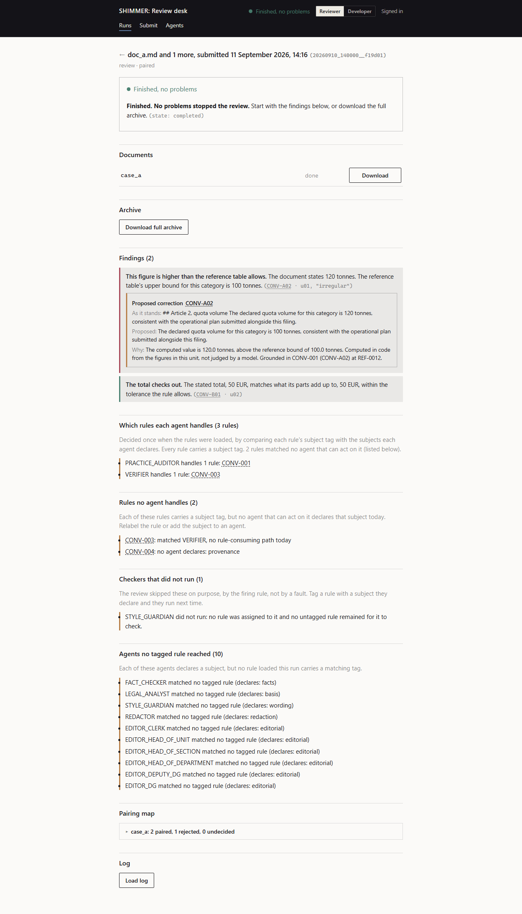
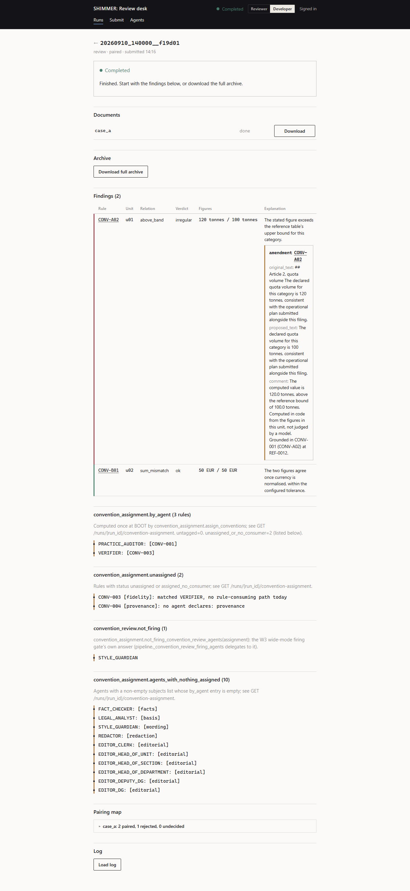
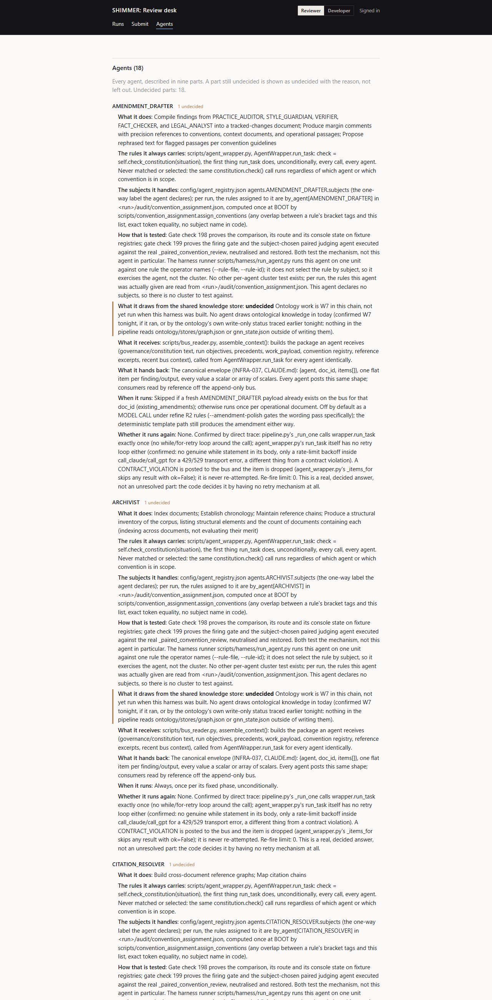
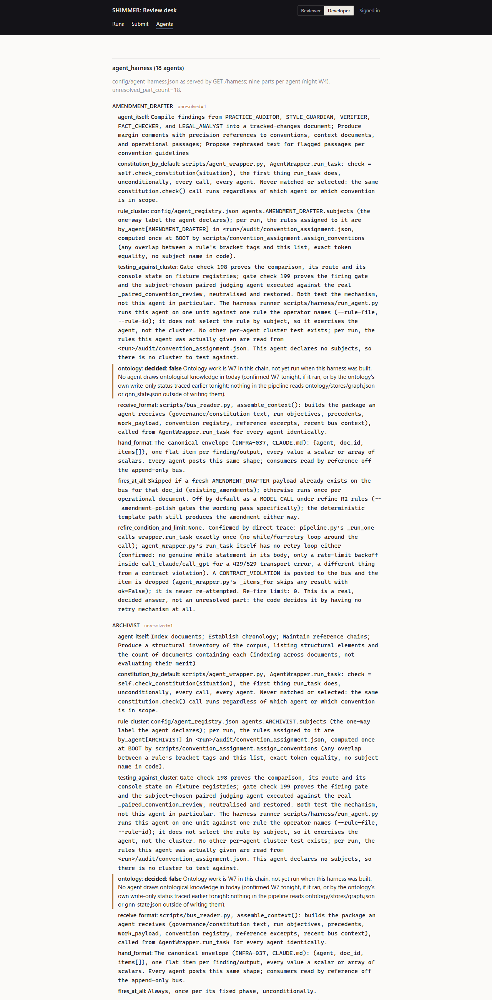

# STEP W8 REPORT: the console

Bring `scripts/ui/console.html` current with everything this chain built, both views, same
design system and rules as the earlier console work: whatever exists is shown, nothing is
hidden because it is awkward, the two views differ in wording only. The instruction lists
four things to surface, each only to the extent the step that built it actually ran, and
its text assumes W2 and W3 were skipped. In this chain they were not: the operator's
re-ordered sequence built the convention assignment (commits 1 to 4) and W3 (commit 3)
before this step, so both are surfaced from what those steps actually produced, not from
anything imagined ahead of them.

## What was already on the console, and what was not

Before this step the run page rendered three of W3's four visible states: an amendment
(under its finding), a refused finding (`amendmentRefusalsHtml`) and a failed contract
(`contractViolationsHtml`); commit 2 had added the rules no agent handles
(`conventionAssignmentHtml`) and an "agents with nothing to check" list (`idleAgentsHtml`).
Not on the console: the distribution itself (which rules went to which agent), the firing
gate's own answer (which convention checker did not run), and the harness from W4 in any
form. The idle-agents wording also carried a defect: with every loaded rule untagged, the
list named PRACTICE_AUDITOR and STYLE_GUARDIAN as having "nothing to check" while both were
in fact receiving every untagged rule (the firing gate's fallback); the console said the
opposite of what phase 5.5 did.

## The four things, each to the extent its step ran

**1. The four visible states from W3.** Three existed. The fourth, an agent that did not
fire, is `notFiringHtml` on the run page, fed by a new field on
`GET /runs/{run_id}/convention-assignment`, `not_firing`. It is the firing gate's own
answer: the gate's rule moved into `convention_assignment.firing_convention_review_agents`
(and `not_firing_convention_review_agents`), the pipeline's `_convention_review_firing_agents`
now delegates to it (name and behavior unchanged; checks 157 and 199 pass unchanged), and
the server reads the same function, so the console shows the decision phase 5.5 made, never
a second computation of it. `not_firing` is empty for an assignment with no rules at all (a
run that predates the assignment, or one that loaded no conventions): there the gate decided
nothing, and "did not run" would be a claim about a decision not made. The section disappears
when every checker ran.

**2. The distribution from W2.** `conventionDistributionHtml` on the run page: one line per
agent that received a rule, the rule ids linked to their text (`GET /rules/{rule_id}`), the
untagged count stated as a fact about the rule set ("N rules carry no subject tag and go to
every convention checker, as before tagging existed"), and the count of rules no agent can
act on, which the existing unassigned list below it itemises. Shown for any run whose BOOT
computed an assignment (`rule_count > 0`); nothing for a run that predates it. The
idle-agents section was reworded to what is true, "matched no tagged rule", and says, when
untagged rules exist, that those still reach every convention checker (the route now also
returns `untagged`).

**3. The harness from W4.** A third masthead tab, Agents (`#/agents`), served by the new
`GET /harness` (token-gated, not run-scoped, `config/agent_harness.json` or
`SHIMMER_AGENT_HARNESS`, a distinct 404 when the harness has not been built on that
server). One section per agent, its nine parts in order; a decided part shows one line
drawn from the file's own fields (what it does, the condition it fires on, the subjects it
declares, or the shared part it points at); an undecided part shows as undecided, with the
reason the file records, on the same peach rail the other visible states use; a part
missing from the file would be shown as missing, never skipped. The reviewer view names the
parts in plain words ("What it draws from the shared knowledge store"), the developer view
uses the file's keys and `decided: false`. Today every agent shows exactly one undecided
part, ontology, with W4's reason; W7 built the ontology foundations but no agent draws from
the store yet, so the part stays honestly undecided (see the W7 report's open list).

**4. The refusals from W5.** W5 fixed the three name mismatches; amendment-refusal
visibility already existed (`amendmentRefusalsHtml`, `GET /runs/{run_id}/amendment-refusals`)
and is unchanged. Nothing to build; recorded here as the instruction asks.

Every new section disappears when it has nothing true to say. None is a placeholder.

## Proof: the running server with the stubbed pipeline, screenshots, both views

`tools/console_preview.py` (the same throwaway harness: real `scripts/server.py`, the
pipeline subprocess stubbed, no model, no key) gained `--screenshots DIR`. It seeds the
fixtures, starts the server in a thread, launches a headless Edge (its own throwaway
profile, never the operator's browser) with a DevTools port, signs the console in exactly
as the masthead's token screen does (the throwaway token written to `sessionStorage`), and
captures each page in each view over the DevTools protocol (`websockets`, already
installed). The "completed, with findings" fixture gained an `audit/convention_assignment.json`
shaped to exercise every state: one rule assigned to PRACTICE_AUDITOR, one matched only by
VERIFIER (no rule-consuming path), one no agent declares, and no untagged rule, so the gate
keeps STYLE_GUARDIAN from running.

The six captures, under `docs/fix/w8_screenshots/`:

| page | reviewer view | developer view |
|---|---|---|
| Runs list | `runs_human.png` | `runs_developer.png` |
| A run's page, findings and the W8 sections | `run_findings_human.png` | `run_findings_developer.png` |
| Agents (top 2600 px of a page some 17000 px tall) | `agents_human.png` | `agents_developer.png` |









What the run-page captures show, read off the images: "Which rules each agent handles (3
rules)" with PRACTICE_AUDITOR and VERIFIER; "Rules no agent handles (2)" naming CONV-003
(matched VERIFIER, no rule-consuming path) and CONV-004 (no agent declares its subject);
"Checkers that did not run (1)": STYLE_GUARDIAN, with the firing rule as the reason; and
"Agents no tagged rule reached (10)". The developer view carries the same four sections
under `convention_assignment.by_agent`, `convention_assignment.unassigned`,
`convention_review.not_firing` and `convention_assignment.agents_with_nothing_assigned`, in
the file's own words. The Agents captures show "Agents (18)" / "agent_harness (18 agents)",
"Undecided parts: 18", and each agent's nine parts with the ontology part on the peach rail
marked undecided / `decided: false` with W4's recorded reason.

Two things the capture itself turned up, both fixed before these images were taken: this
helper stubs `subprocess.Popen` so the pipeline never runs, and that stub swallowed the
browser launch the first time (the browser is now started through the real `Popen`, kept
aside before the stub is installed); and the Agents page's "What it does" line led with the
part's `where` field rather than its `does` list, so the reviewer view named the registry
path instead of the agent's duties (the summary now leads with `does`).

## Gate check 203, proved by neutralise, fail, restore, pass

Executed against the real FastAPI app on tempdir fixtures (token hash, output dir, agent
registry and harness all redirected through the `SHIMMER_*` environment the server reads at
import; the real `config/` and `output/` untouched): `GET /harness` without a token is 401;
with one it serves the fixture's two agents, names the nine parts, reports the one
`decided: false` part per agent with its own reason, and returns a distinct 404 once the
harness file is removed; `GET /runs/{id}/convention-assignment` returns `not_firing:
["STYLE_GUARDIAN"]` and `untagged: 0` for the fixture assignment and `idle_agents` naming
STYLE_GUARDIAN only; the module gate agrees with `pipeline._convention_review_firing_agents`
on the same assignment, lets every agent fire on `None` and on an untagged rule, and returns
no one as not-firing for an assignment with no rules; and `console.html` carries every
section that renders these (`conventionDistributionHtml`, `notFiringHtml`, `harnessHtml`,
`renderAgents`, the Agents nav entry and route, the two new holders, and the reads of
`not_firing` and `untagged`).

Neutralised, with the firing gate replaced by one that lets every agent fire:

```
('FAIL', 'the gate should keep STYLE_GUARDIAN from firing on this assignment (no rule, no untagged rule): []')
```

(The body tests the module function before the route, so the neutralisation is caught
there first; the route assertion behind it fails the same way.)

Restored: `PASS`. The check runs its body three times on every gate run and reports all
three in its PASS line.

Also passing on the new surface: check 167 (the README route table now carries `/harness`
and the enriched convention-assignment row, exactly the app's routes), check 116 (the env
table carries `SHIMMER_AGENT_HARNESS`), checks 157, 198 and 199 (the gate delegation
changed nothing they prove).

## Gate result

```
PASS=202  WARN=0  SKIP=0  FAIL/ERROR=2  TOTAL=204
```

`output/w8_gate1.log`. One check added over W7's 203, one more pass, WARN unchanged at 0,
the same two pre-existing failures (checks 01 and 145). Wb holds. The one edit made after
that full run (the Agents page's "What it does" line leading with the agent's duties) is
wording inside `console.html` only; every check that reads that file was re-run afterwards
and passes.

## What changed

- `scripts/convention_assignment.py`: `firing_convention_review_agents`,
  `not_firing_convention_review_agents`.
- `scripts/pipeline.py`: `_convention_review_firing_agents` delegates to the module.
- `scripts/server.py`: `AGENT_HARNESS_PATH` (`SHIMMER_AGENT_HARNESS`), `HARNESS_PART_NAMES`,
  `GET /harness`; the convention-assignment route returns `untagged` and `not_firing`.
- `scripts/ui/console.html`: the Agents tab, route and page (`renderAgents`, `harnessHtml`,
  `harnessPartSummary`, `HARNESS_PART_LABELS_HUMAN`, the harness styles);
  `conventionDistributionHtml`, `notFiringHtml`, the reworded `idleAgentsHtml`; two new
  holders on the run page.
- `tools/console_preview.py`: the assignment fixture; `--screenshots DIR` (`_find_browser`,
  `_wait_http`, `SCREENSHOT_PAGES`, `_shoot_pages`, `_capture_screenshots`, `_REAL_POPEN`).
- `scripts/verify_session1.py`: check 203.
- `README.md`: route table, env table, the console paragraph, the check total (204).
- `docs/fix/w8_screenshots/`: the six captures.

## Not done, on purpose

No section for anything a step in this chain did not produce. The harness's ontology part
stays undecided on the console because it is undecided in the file; W7 built the store, no
agent reads it, and marking it decided would be the dormant scaffold this project forbids.

---

STEP W8 COMPLETE (the distribution, the fourth visible state, the harness and the existing
refusals on the console in both views; proved on the stubbed server with screenshots and by
check 203)
